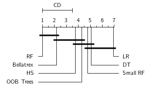
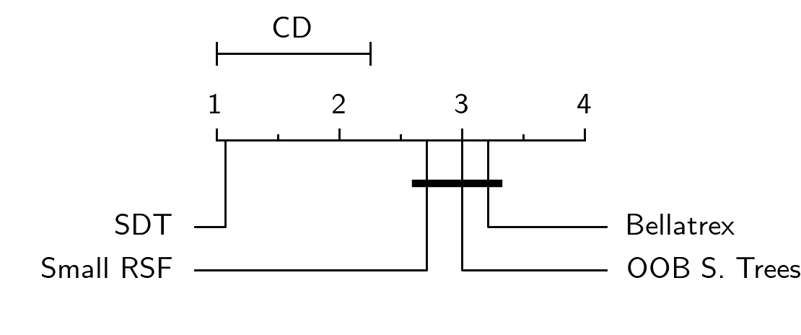
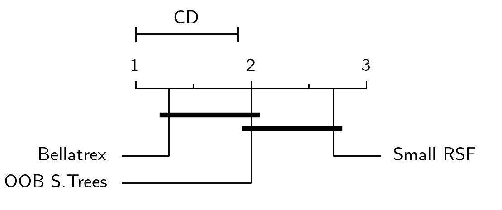
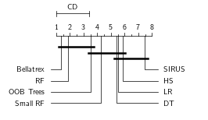
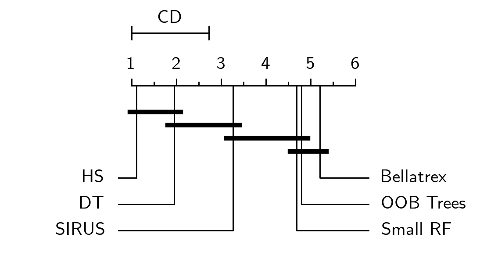
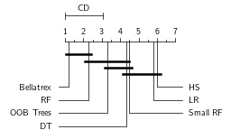
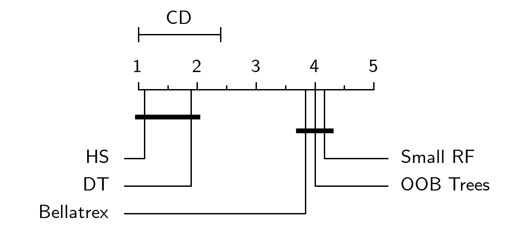
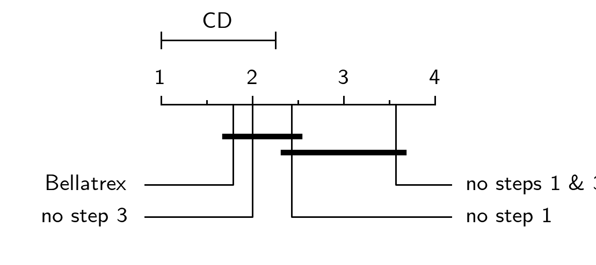
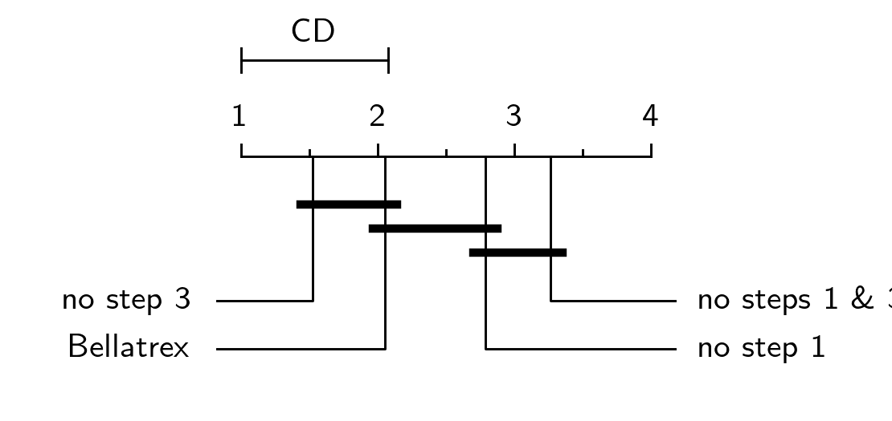

# Bellatrex

Random Forest models can be difficult to interpret, and Bellatrex addresses this challenge by generating explanations that are easy to understand, and by providing insights into how the model arrived at its predictions. Belllatrex does so by Building Explanations through a LocalLy AccuraTe Rule EXtractor (hence the name: Bellatrex) for a given test instance, by extracting only a few, diverse rules.

To illustrate how Bellatrex works, let's consider an example: when a user provides a test instance to Bellatrex, the tool begins by 1) pre-selecting a subset of the rules used to make the prediction; it then creates 2) a vector representation of such rules and 3) projects them to a low-dimensional space; Bellatrex then 4) clusters such representations to pick a rule from each cluster to explain the instance prediction. One rule per cluster is shown to the end user through visually appealing plots, and the tool's GUI allows users to explore similar rules to those extracted.
            

  

  <em>Overview representation of Bellatrex, starting from top left, proceeding clockwise, we reach the output and explanation on the bottom left.</em>

Another strength of Bellatrex lies in its ability to handle several prediction tasks within `scikit-learn` implementations of Random Forests. For instance, Bellatrex can generate explanations for binary classification and multi-label predictions  tasks with `RandomForestClassifier`, as well as single- or multi-output regression tasks with `RandomForestRegressor`. Moreover, Bellatrex is compatible with scikit-survival's `RandomSurvivalForest`, allowing it to generate explanations for time-to-event predictions in the presence of right-censored data.

This repository contains:
- instructions to run Bellatrex on your machine
- an overwview of the datasets used to test the effectiveness of the method
- accesss to the aforementioned (post-processed) datasets
- the detailed final results and relative statistical analysis of the manuscript for the BELLATREX method, currently under revision.
- the model's code, prediction, and tuned hyperparameters. To be shared upon acceptance.

## Instructions
 
To ensure that Bellatrex runs correctly, use a Python environment that matches the requirements indicated in `requirements.txt`. Slightly older versions might also work, but `DeprecationWarning` messages will be raised. Compatibility with Linux or OS architectures has not been tested.

To get started, the user can replicate some simple examples by running the 
`tutorial.py` script.

# Additional material (draft)

I would drop this part upon acceptance of the paper, since it's included in the paper Appendix already.

consider adding a detailed example: take an instance adn a trained RF, go through the code in `tutorial.py` and exlain what is being done step by step.

++++++++++++++++++++++++++++++++++++++++++++++++++++++++++++++++++++++++++++++++++++++++++++++++++

In order not to overcrowd the final manuscript with tables and plots, we share here some details about the datasets employed in the comparison as well as an extended version of the results.

## Dataset overview

Here we share details about the datasets in use for the comparison. In particular, we share information such as number of instances ``n`` and number of covariates ``p``. Additionally:
- for binary classification data we report the prevalence of the positive class;
- for time-to-event (survival) data we report the frequency of the censoring effect
- for multi-label classification and multi-target regression, we report the number of output labels (or classes).

### Binary classification data

|  Dataset name    | Dataset size ``(n,p)`` | % positive class |
|:-----------------------------:|:-------------------:|:-----:|
| blood                         | (748 , 4)           | 24 |
| breast cancer diagnostic   | (569, 30)           | 37 |
| breast cancer          | (699, 10)           | 34 |
| breast cancer prognostic   | (198, 33)           | 24 |
| breast cancer coimba   | (116, 9)            | 55 |
| colonoscopy Green	  | (98, 62)            | 68 |
| colonoscopy Hinselmann | (97, 62)            | 85 |
| colonoscopy Schiller | (92, 62)            | 73 |
| divorce                       | (170, 54)           | 49 |
| Flowmeters                    | (87, 36)            | 60 |
| haberman                      | (306, 3)            | 26 |
| hcc-survival                  | (165, 49)           | 62 |
| ionosphere                    | (351, 34)           | 36 |
| LSVT voice                    | (126, 310)          | 67 |
| mamographic                   | (961, 5)            | 46 |
| musk                          | (476, 166)          | 43 |
| parkinson                     | (756, 753)          | 75 |
| risk factors                  | (858, 35)           | 6  |
| crashes                       | (540, 18)           | 91 |
| sonar                         | (208, 60)           | 53 |
| SPECT                         | (267, 22)           | 79 |
| SPECTF                        | (267, 44)           | 79 |
| vertebral                     | (310, 6)            | 68 |
| wholesale                     | (440, 7)            | 32 |

### Time-to-event data

|  Dataset name    | Dataset size ``(n,p)`` | % censoring |
|:-----------------------------:|:-------------------:|:-----:|
| addicts                                           | (238, 3)            | 37 |
| breast cancer survival                     | (198, 80)           | 74 |
| DBCD                                              | (295, 4919)         | 73 |
| DLBCL                                             | (240, 7399)         | 43 |
| echocardiogram                                    | (130, 9)            | 32 |
| FLChain                                           | (7874, 8)           | 72 |
| gbsg2                                             | (686, 8)            | 56 |
| lung                                              | (228, 8)            | 28 |
| NHANES I											 | (9931, 18)          | 65 |
| PBC                                               | (403, 19)           | 56 |
| rotterdam [^1] | (2982, 11)          | 57 |
| rotterdam [^2] | (2982, 12)          | 57 |
| veteran                                           | (137, 9)            | 7  |
| whas500                                           | (500, 14)           | 57 |

[^1]: excl. ``recurr`` covariate

[^2]: incl. ``recurr`` covariate

### Multi-label classification data

|  Dataset name    | Dataset size ``(n,p)`` | n. labels |
|:-------------:|:-------------------:|:---:|
| birds         | (645, 260)          | 19  |
| CAL500        | (502, 68)           | 174 |
| emotions      | (593, 72)           | 6   |
| enron         | (1702, 1001)        | 53  |
| flags         | (193, 19)           | 7   |
| genbase       | (662, 1185)         | 27  |
| langlog       | (1460, 1004)        | 75  |
| medical       | (978, 1449)         | 45  |
| ng20          | (4379, 1006)        | 20  |
| scene         | (2407, 294)         | 6   |
| slashdot      | (3782, 1079)        | 22  |
| stackex chess | (1675, 585)         | 227 |
| yeast         | (2417, 103)         | 14  |

### Regression data

|  Dataset name    | Dataset size ``(n,p)`` |
|:------------------:|:-------------------:|
| airfoil            | (1503, 5)           |
| Ames Housing       | (2915, 283)         |
| auto mpg           | (398, 7)            |
| bike sharing       | (731, 12)           |
| boston housing     | (506, 14)           |
| california housing | (20640, 8)          |
| car imports        | (201, 63)           |
| Computer hardware  | (209, 6)            |
| concrete compress  | (1030, 8)           |
| concrete slump     | (103, 9)            |
| ENB2012 cooling    | (768, 8)            |
| ENB2012 heating    | (768, 8)            |
| forest fires       | (517, 12)           |
| PRSA data          | (41757, 13)         |
| slump dataset      | (103, 9)            |
| students maths     | (395, 43)           |
| wine quality all   | (6497, 12)          |
| wine quality red   | (1599, 11)          |
| wine quality white | (4898, 11)          |

### Multi-target regression data

|  Dataset name    | Dataset size ``(n,p)`` | n. targets |
|:-------:|:-------------------:|:------:|
| andro   | (49, 30)            | 6  |
| atp1d   | (337, 370)          | 6  |
| atp7d   | (296, 370)          | 6  |
| edm     | (154, 16)           | 2  |
| enb     | (768, 8)            | 2  |
| ENB2012 | (768, 8)            | 2  |
| jura    | (359, 15)           | 3  |
| oes10   | (403, 298)          | 16 |
| oes97   | (334, 263)          | 16 |
| osales  | (639, 401)          | 12 |
| rf1     | (9125, 64)          | 8  |
| rf2     | (4332, 576)         | 8  |
| scm1d   | (9803, 280)         | 16 |
| scm20d  | (8966, 61)          | 16 |
| scpf    | (1137, 23)          | 3  |
| sf1     | (323, 10)           | 3  |
| sf2     | (1066, 9)           | 3  |
| slump   | (103, 7)            | 3  |
| wq      | (1060, 16)          | 14 |

# Final Results

Here we share an extended version of the results. In particular, we compare Bellatrex against several competing methods and share the obtained performance, complexity, and dissimilarity at a dataset specific level. 
The procedure is repeated for binary classification data, as well as for multi-label classification, time-to-event, regression, and multi-target regression datasets; the statistical significance of the results is evaluated through the Friedmnan-Nemenyi post-hoc test.
Additionally, detailed results of the ablation study are shared.

## Binary classification

### Performance

|                | RF     | Bellatrex       | OOB Trees | DT     | Small RF | LR              | SIRUS           | C443            | RuleCOSI+ | HS              |
|:--------------:|:------:|:---------------:|:---------:|:------:|:--------:|:---------------:|:---------------:|:---------------:|:---------:|:---------------:|
| blood          | 0.7080 | 0.7041          | 0.6474    | 0.7048 | 0.6413   | **0.7394** | 0.7327          | 0.6256          | 0.6419    | 0.7209          |
| breast cancer diagn.    | 0.9836 | **0.9867** | 0.9393    | 0.9601 | 0.9526   | 0.9645          | 0.9806          | 0.9748          | 0.9400    | 0.9655          |
| breast cancer original  | 0.9958 | 0.9954          | 0.9665    | 0.9626 | 0.9696   | 0.9970          | **0.9974** | 0.9923          | 0.9749    | 0.9625          |
| breast cancer progn.    | 0.5015 | 0.5348          | 0.5689    | 0.5893 | 0.5230   | **0.6370** | 0.5896          | 0.5504          | 0.5374    | 0.6333          |
| breast cancer coimba    | 0.7569 | 0.7508          | 0.6846    | 0.7108 | 0.6085   | **0.8108** | 0.7415          | 0.6762          | 0.5938    | 0.7200          |
| colonoscopy Green     | 0.9333 | **0.9449** | 0.8128    | 0.6962 | 0.7526   | 0.6718          | 0.7974          | 0.8333          | 0.7154    | 0.7897          |
| colonoscopy Hinselm.  | 0.5917 | 0.6229          | 0.5875    | 0.6146 | 0.4667   | 0.4833          | **0.6458** | 0.5813          | 0.5812    | 0.5792          |
| colonoscopy Schiller  | 0.6277 | 0.5923          | 0.5369    | 0.5600 | 0.5385   | 0.6615          | 0.6662          | **0.6969** | 0.6000    | 0.5246          |
| divorce        | 0.9941 | 0.9471          | 0.9412    | 0.9349 | 0.9405   | **1.0000** | 0.9920          | 0.9716          | 0.9325    | 0.9294          |
| Flowmeters     | 0.9943 | **0.9771** | 0.9271    | 0.9086 | 0.7800   | 0.4771          | 0.9286          | 0.9157          | 0.9514    | 0.9314          |
| haberman       | 0.6897 | 0.6786          | 0.6400    | 0.6185 | 0.6269   | 0.6856          | **0.6883** | 0.6763          | 0.5550    | 0.6175          |
| hcc-survival   | 0.8331 | **0.8250** | 0.6688    | 0.7162 | 0.7377   | 0.4192          | 0.7831          | 0.6369          | 0.6008    | 0.7138          |
| ionosphere     | 0.9828 | **0.9812** | 0.9204    | 0.9276 | 0.9067   | 0.9020          | 0.9406          | 0.9420          | 0.8251    | 0.9386          |
| LSVT voice     | 0.8824 | **0.8882** | 0.7404    | 0.7699 | 0.7228   | 0.6191          | 0.7993          | 0.7846          | 0.7022    | 0.7566          |
| mamographic    | 0.8523 | 0.8510          | 0.8247    | 0.8355 | 0.8249   | 0.8316          | 0.8439          | 0.8352          | 0.8072    | **0.8539** |
| musk           | 0.9511 | **0.9475** | 0.8300    | 0.7716 | 0.8088   | 0.9132          | 0.7562          | 0.8633          | 0.7158    | 0.7983          |
| parkinson      | 0.9349 | **0.9128** | 0.7912    | 0.7819 | 0.7766   | 0.3051          | 0.7424          | 0.8099          | 0.7663    | 0.7789          |
| risk factors   | 0.9709 | 0.9339          | 0.9050    | 0.9379 | 0.8745   | **0.9801** | 0.9420          | 0.7176          | 0.8179    | 0.9408          |
| simul. crashes | 0.9284 | 0.9012          | 0.8335    | 0.7594 | 0.8027   | **0.9654** | 0.8663          | 0.5799          | 0.7939    | 0.7700          |
| sonar          | 0.9163 | **0.9117** | 0.7591    | 0.7498 | 0.7347   | 0.8455          | 0.8045          | 0.7493          | 0.7617    | 0.7622          |
| SPECT          | 0.7695 | 0.7489          | 0.7411    | 0.6957 | 0.7037   | **0.7870** | 0.7305          | 0.7682          | 0.7169    | 0.7502          |
| SPECTF         | 0.8203 | **0.7920** | 0.6193    | 0.6485 | 0.7273   | 0.7442          | 0.7838          | 0.7087          | 0.6656    | 0.6816          |
| vertebral      | 0.9550 | 0.9477          | 0.9002    | 0.8907 | 0.8530   | **0.9562** | 0.8954          | 0.8423          | 0.8962    | 0.8762          |
| wholesale      | 0.9554 | **0.9525** | 0.9056    | 0.9322 | 0.9141   | 0.9023          | 0.9382          | 0.9364          | 0.9163    | 0.9390          |
| Average        | 0.8554 | **0.8470** | 0.7788    | 0.7782 | 0.7578   | 0.7625          | 0.8161          | 0.7779          | 0.7504    | 0.7889          |

Running the post-hoc Friedman-Nemenyi statistical procedure on the above table leads to the following results:

### Complexity

|                | Bellatrex (avg. n.rules) | OOB Trees | Small RF | DT            | SIRUS | RuleCOSI+     | C443  | HS            |
|:--------------:|:--------------------:|:---------:|:--------:|:-------------:|:-----:|:-------------:|:-----:|:-------------:|
| blood          | 15.13 (1.89)         | 14.94     | 14.40    | 6.39          | 12.00 | 4.09          | 22.59 | **3.39** |
| breast cancer diagn.    | 5.49 (1.25)          | 5.79      | 5.93     | 4.13          | 13.40 | **3.48** | 13.10 | 4.05          |
| breast cancer original  | 5.53 (1.20)          | 6.13      | 5.00     | 4.01          | 11.60 | **3.45** | 13.48 | 4.85          |
| breast cancer progn.    | 9.79 (2.03)          | 10.56     | 11.19    | **4.13** | 10.00 | 9.13          | 15.61 | 4.33          |
| breast cancer coimba    | 9.37 (2.18)          | 9.57      | 9.36     | **3.39** | 11.20 | 8.17          | 13.89 | 4.32          |
| colonoscopy Green     | 7.03 (1.85)          | 8.44      | 8.23     | **3.76** | 10.20 | 5.98          | 13.07 | 4.82          |
| colonoscopy Hinselm.  | 6.28 (1.74)          | 6.94      | 6.31     | **2.71** | 10.20 | 4.23          | 10.92 | 4.28          |
| colonoscopy Schiller  | 6.70 (1.89)          | 7.97      | 7.08     | **3.03** | 10.20 | 4.83          | 11.08 | 3.41          |
| divorce        | 1.47 (1.04)          | 1.45      | 1.73     | **1.29** | 10.40 | 1.53          | 4.64  | 1.39          |
| Flowmeters     | 4.89 (1.67)          | 5.44      | 4.76     | **2.61** | 11.60 | 2.76          | 8.27  | 2.78          |
| haberman       | 13.48 (1.91)         | 12.88     | 13.12    | 5.73          | 13.20 | 7.25          | 19.71 | **5.22** |
| hcc-survival   | 9.56 (2.18)          | 10.87     | 11.00    | 4.56          | 10.00 | 7.32          | 15.64 | **4.32** |
| ionosphere     | 8.01 (1.49)          | 10.37     | 9.27     | **5.08** | 14.60 | 7.40          | 17.54 | 5.27          |
| LSVT voice     | 6.60 (1.86)          | 7.20      | 7.06     | **3.22** | 10.20 | 5.51          | 10.48 | 3.72          |
| mamographic    | 16.21 (1.67)         | 16.34     | 14.89    | 7.82          | 12.00 | 8.36          | 21.33 | **4.08** |
| musk           | 12.48 (1.92)         | 13.72     | 13.79    | 6.09          | 12.80 | 11.59         | 21.32 | **5.76** |
| parkinson      | 13.39 (1.66)         | 14.14     | 13.59    | 9.42          | 10.80 | 8.58          | 23.54 | **4.10** |
| risk factors   | 7.27 (1.15)          | 8.73      | 9.25     | 5.49          | 15.60 | **5.22** | 23.54 | 6.57          |
| simul. crashes | 6.48 (1.34)          | 6.71      | 6.58     | **3.61** | 13.00 | 3.78          | 15.86 | 4.46          |
| sonar          | 8.29 (2.01)          | 9.33      | 9.62     | **3.74** | 10.40 | 9.42          | 14.04 | 4.02          |
| SPECT          | 11.55 (1.84)         | 12.04     | 12.04    | **4.17** | 15.00 | 5.40          | 11.87 | 4.77          |
| SPECTF         | 7.85 (1.85)          | 8.62      | 8.78     | **4.17** | 10.80 | 7.27          | 13.48 | 5.32          |
| vertebral      | 7.25 (1.56)          | 7.42      | 7.46     | **3.70** | 11.80 | 6.17          | 14.20 | 4.37          |
| wholesale      | 6.74 (1.39)          | 6.65      | 6.31     | 4.35          | 13.00 | **2.96** | 14.87 | 4.52          |
| Average        | 8.62 (1.69)          | 9.26      | 9.03     | 4.44          | 11.83 | 6.00          | 15.17 | **4.34** |

Similarly, the statistical testing for the complexity of the explanations:

### Dissimilarity

|                | OOB Trees | Small RF | Bellatrex       | C443            |
|:--------------:|:---------:|:--------:|:---------------:|:---------------:|
| blood          | 0.5398    | 0.5743   | **0.6366** | 0.6080          |
| breast cancer diagn.    | 0.8799    | 0.8966   | 0.9569          | **0.9797** |
| breast cancer original  | 0.7563    | 0.7349   | 0.8534          | **0.9027** |
| breast cancer progn.    | 0.9266    | 0.9251   | 0.9635          | **0.9696** |
| breast cancer coimba    | 0.7862    | 0.7894   | 0.8769          | **0.8923** |
| colonoscopy Green     | 0.9241    | 0.9561   | 0.9882          | **0.9955** |
| colonoscopy Hinselm.  | 0.8747    | 0.9636   | 0.9739          | **0.9866** |
| colonoscopy Schiller  | 0.9462    | 0.9659   | **0.9933**      | 0.9892     |
| divorce        | 0.8936    | 0.9349   | **1.0000**      | 0.9959     |
| Flowmeters     | 0.8513    | 0.9477   | 0.9901          | **1.0000** |
| haberman       | 0.5380    | 0.5686   | 0.6589          | **0.7616** |
| hcc-survival   | 0.9439    | 0.9381   | 0.9683          | **0.9998** |
| ionosphere     | 0.8948    | 0.9068   | 0.9450          | **0.9741** |
| LSVT voice     | 0.9826    | 0.9901   | **0.9971** | 0.9811          |
| mamographic    | 0.5175    | 0.5605   | 0.6185          | **0.6367** |
| musk           | 0.9773    | 0.9679   | 0.9894          | **0.9979** |
| parkinson      | 0.9867    | 0.9922   | 0.9963          | **0.9996** |
| risk factors   | 0.8167    | 0.8778   | 0.9414          | **0.9832** |
| simul. crashes | 0.7532    | 0.8415   | 0.9004          | **0.9896** |
| sonar          | 0.9281    | 0.9555   | 0.9848          | **0.9983** |
| SPECT          | 0.8617    | 0.8656   | 0.8979          | **0.9389** |
| SPECTF         | 0.9231    | 0.9424   | 0.9608          | **0.9823** |
| vertebral      | 0.6531    | 0.6970   | 0.7868          | **0.8439** |
| wholesale      | 0.6871    | 0.7425   | 0.8277          | **0.8813** |
| Average        | 0.8268    | 0.8556   | 0.9044          | **0.9286** |

And the statistical testing for the rule dissimilarity:

## Multi-label classification

### Performance

|               | RF     | Bellatrex       | OOB Trees | DT     | Small RF | LR     | HS              |
|---------------|--------|-----------------|-----------|--------|----------|--------|-----------------|
| birds         | 0.9199 | **0.8190** | 0.7862    | 0.7371 | 0.7818   | 0.4563 | 0.7565          |
| CAL500        | 0.5781 | **0.5428** | 0.5327    | 0.5206 | 0.5349   | 0.5085 | 0.5427          |
| emotions      | 0.8520 | **0.8205** | 0.7586    | 0.7453 | 0.7498   | 0.4399 | 0.7846          |
| enron         | 0.8192 | **0.7707** | 0.7322    | 0.7190 | 0.7164   | 0.5071 | 0.7349          |
| flags         | 0.7458 | **0.7237** | 0.6882    | 0.6799 | 0.6336   | 0.6372 | 0.6938          |
| genbase       | 1.0000 | **0.9977** | 0.9928    | 0.9971 | 0.9944   | 0.5019 | 0.9976          |
| langlog       | 0.7575 | 0.6075          | 0.6012    | 0.6107 | 0.5991   | 0.5099 | **0.6940** |
| medical       | 0.9841 | **0.9497** | 0.9102    | 0.9279 | 0.8954   | 0.5182 | 0.9461          |
| ng20          | 0.9631 | **0.9225** | 0.8525    | 0.8360 | 0.8630   | 0.4996 | 0.8180          |
| scene         | 0.9477 | **0.9195** | 0.8437    | 0.7865 | 0.8451   | 0.5023 | 0.8353          |
| slashdot      | 0.8691 | **0.8186** | 0.7669    | 0.7716 | 0.7754   | 0.4978 | 0.7263          |
| stackex chess | 0.8330 | **0.6928** | 0.6670    | 0.6538 | 0.6653   | 0.5016 | 0.6916          |
| yeast         | 0.7455 | **0.6777** | 0.6491    | 0.6063 | 0.6197   | 0.5180 | 0.6393          |
| Average       | 0.8473 | **0.7894** | 0.7524    | 0.7378 | 0.7441   | 0.5076 | 0.7585          |

Running the post-hoc Friedman-Nemenyi statistical procedure on the above table leads to the following results:

### Complexity

|                | Bellatrex (n. rules) | OOB Trees | Small RF | DT            | HS            |
|:--------------:|:--------------------:|:---------:|:--------:|:-------------:|:-------------:|
| birds          | 23.43 (2.19)         | 23.97     | 24.72    | 8.72          | **4.82** |
| CAL500 | 29.29 (2.95)                 | 31.29     | 29.87    | 7.78          | **4.26** |
| emotions       | 19.48 (2.63)         | 21.84     | 22.61    | 7.14          | **4.40** |
| enron          | 57.84 (2.73)         | 59.84     | 56.64    | 12.41         | **4.72** |
| flags          | 16.51 (2.76)         | 17.65     | 18.10    | 5.10          | **4.27** |
| genbase        | 22.64 (1.34)         | 20.48     | 21.68    | **5.19** | 5.79          |
| langlog        | 42.98 (2.40)         | 39.50     | 38.19    | 15.98         | **7.02** |
| medical        | 59.49 (2.57)         | 56.71     | 56.08    | 9.66          | **6.06** |
| ng20           | 127.97 (2.54)        | 122.78    | 119.65   | 34.52         | **6.30** |
| scene          | 25.95 (2.38)         | 26.71     | 26.88    | 10.45         | **3.38** |
| slashdot       | 248.33 (2.52)        | 244.98    | 240.03   | 55.76         | **5.50** |
| stackex chess  | 111.52 (2.78)        | 100.02    | 100.56   | 17.60         | **5.14** |
| yeast          | 33.51 (2.78)         | 37.18     | 35.60    | 11.96         | **5.10** |
| Average        | 63.00 (2.51)         | 61.77     | 60.82    | 15.56         | **5.14** |

Similarly, the statistical testing for the complexity of the explanations:

### Dissimilarity

|               | OOB Trees | Small RF | Bellatrex       |
|:-------------:|:---------:|:--------:|:---------------:|
| birds         | 0.9544    | 0.9664   | **0.9859** |
| CAL500        | 0.9589    | 0.9494   | **0.9731** |
| emotions      | 0.9318    | 0.9430   | **0.9772** |
| enron         | 0.9652    | 0.9754   | **0.9847** |
| flags         | 0.8615    | 0.8496   | **0.9115** |
| genbase       | 0.9255    | 0.9364   | **0.9465** |
| langlog       | 0.9690    | 0.9800   | **0.9886** |
| medical       | 0.9507    | 0.9571   | **0.9700** |
| ng20          | 0.8614    | 0.9093   | **0.9169** |
| scene         | 0.9543    | 0.9768   | **0.9908** |
| slashdot      | 0.8606    | 0.8830   | **0.8873** |
| stackex chess | 0.8862    | 0.9272   | **0.9404** |
| yeast         | 0.9330    | 0.9406   | **0.9662** |
| Average       | 0.9240    | 0.9380   | **0.9569** |

And the statistical testing for the rule dissimilarity:

## Time-to-event

### Performance

|                          | RSF    | Bellatrex       | OOB S. Trees | SDT             | Small RSF | Cox PH          |
|:------------------------:|:------:|:---------------:|:------------:|:---------------:|:---------:|:---------------:|
| addicts                  | 0.6497 | 0.6512          | 0.6065       | 0.6323          | 0.6205    | **0.6563** |
| breast cancer survival            | 0.6524 | **0.6417** | 0.5619       | 0.5863          | 0.5619    | 0.5708          |
| DBCD                     | 0.7549 | **0.7534** | 0.5940       | 0.5574          | 0.6686    | 0.7206          |
| DLBCL                    | 0.6352 | **0.6357** | 0.5697       | 0.5796          | 0.5456    | 0.6160          |
| echocardiogram           | 0.4145 | 0.4166          | 0.4427       | **0.4958** | 0.4785    | 0.4096          |
| FLChain                  | 0.8312 | **0.8330** | 0.8105       | 0.7683          | 0.7858    | 0.8218          |
| gbsg2                    | 0.7022 | **0.7035** | 0.6850       | 0.6434          | 0.6419    | 0.6876          |
| lung                     | 0.6216 | **0.6236** | 0.5816       | 0.5904          | 0.5386    | 0.6056          |
| NHANES I                 | 0.8205 | **0.8209** | 0.7358       | 0.7435          | 0.7584    | 0.8043          |
| PBC                      | 0.8469 | **0.8467** | 0.7977       | 0.7601          | 0.7780    | 0.8192          |
| rotterdam [^1] | 0.7954 | **0.7961** | 0.7581       | 0.7518          | 0.7731    | 0.7668          |
| rotterdam [^2] | 0.9038 | **0.9047** | 0.8774       | 0.8418          | 0.8652    | 0.8996          |
| veteran                  | 0.7349 | 0.7349          | 0.6547       | 0.6983          | 0.6546    | **0.7452** |
| whas500                  | 0.7449 | **0.7458** | 0.6922       | 0.6730          | 0.6763    | 0.7332          |
| Average                  | 0.7220 | **0.7224** | 0.6691       | 0.6659          | 0.6676    | 0.7040          |

Running the post-hoc Friedman-Nemenyi statistical procedure on the above table leads to the following results:

### Complexity

|                          | Bellatrex (n. rules) | OOB S. Trees   | Small RSF | SDT            |
|:------------------------:|:--------------------:|:--------------:|:---------:|:--------------:|
| addicts                  | 10.51 (2.17)         | 9.46           | 10.07     | **5.07**  |
| breast cancer survival   | 10.82 (2.26)         | 11.02          | 11.73     | **7.91**  |
| DBCD                     | 21.11 (2.26)         | **16.93**      | 19.64     | 17.23     |
| DLBCL                    | 26.98 (2.40)         | 23.61          | 23.53     | **21.39** |
| echocardiogram           | 10.15 (2.25)         | 10.18          | 9.73      | **5.75**  |
| FLChain                  | 31.73 (2.31)         | 32.15          | 31.69     | **15.20** |
| gbsg2                    | 19.04 (2.33)         | 17.79          | 18.01     | **9.13**  |
| lung                     | 12.86 (2.29)         | 11.88          | 12.30     | **6.73**  |
| NHANES I                 | 29.85 (2.08)         | 29.47          | 28.94     | **17.65** |
| PBC                      | 14.70 (2.28)         | 15.07          | 14.91     | **8.82**  |
| rotterdam [^1]           | 21.88 (2.18)         | 21.83          | 21.79     | **10.52** |
| rotterdam [^2]           | 21.83 (2.22)         | 22.90          | 21.48     | **10.73** |
| veteran                  | 9.90 (2.33)          | 10.80          | 11.11     | **5.39**  |
| whas500                  | 15.76 (2.35)         | 15.89          | 15.79     | **8.10**  |
| Average                  | 18.42 (2.27)         | 17.78          | 17.91     | **10.69** |

Similarly, the statistical testing for the complexity of the explanations:

### Dissimilarity

|                          | OOB S.Trees     | Small RSF | Bellatrex       |
|:------------------------:|:---------------:|:---------:|:---------------:|
| addicts                  | **0.6032**      | 0.4419    | 0.5679     |
| breast cancer survival   | 0.9657          | 0.9563    | **0.9841** |
| DBCD                     | 0.9969          | 0.9978    | **0.9990** |
| DLBCL                    | 0.9876          | 0.9971    | **0.9994** |
| echocardiogram           | 0.7952          | 0.7905    | **0.8567** |
| FLChain                  | 0.6214          | 0.6761    | **0.7430** |
| gbsg2                    | **0.7691**      | 0.7242    | 0.7633     |
| lung                     | 0.8182          | 0.7743    | **0.8395** |
| NHANES I                 | 0.7953          | 0.7945    | **0.8391** |
| PBC                      | 0.8495          | 0.8239    | **0.8664** |
| rotterdam [^1]           | **0.7958**      | 0.7333    | 0.7614     |
| rotterdam  [^2]          | 0.7501          | 0.7541    | **0.8187** |
| veteran                  | 0.7904          | 0.7461    | **0.8167** |
| whas500                  | **0.8503**      | 0.7977    | 0.8305     |
| Average                  | 0.8135          | 0.7863    | **0.8352** |

[^1]: excl. ``recurr`` covariate
[^2]: incl. ``recurr`` covariate

And the statistical testing for the rule dissimilarity:

## Regression

### Performance

|                     | RF     | Bellatrex       | OOB Trees | DT     | Small RF        | Ridge           | SIRUS  | HS     |
|:-------------------:|:------:|:---------------:|:---------:|:------:|:---------------:|:---------------:|:------:|:------:|
| airfoil             | 0.0373 | **0.0374** | 0.0492    | 0.0645 | 0.0493          | 0.1069          | 0.1195 | 0.0896 |
| AmesHousing         | 0.0229 | 0.0230          | 0.0280    | 0.0308 | 0.0297          | **0.0226** | 0.0504 | 0.0356 |
| auto mpg            | 0.0525 | **0.0525** | 0.0615    | 0.0644 | 0.0664          | 0.0676          | 0.0871 | 0.0692 |
| bike sharing        | 0.0481 | **0.0481** | 0.0586    | 0.0635 | 0.0594          | 0.0783          | 0.0933 | 0.0713 |
| boston housing      | 0.0577 | **0.0576** | 0.0650    | 0.0747 | 0.0724          | 0.0824          | 0.0842 | 0.0694 |
| california housing  | 0.0613 | **0.0611** | 0.0726    | 0.0848 | 0.0791          | 0.1040          | 0.1438 | 0.1045 |
| car imports         | 0.0362 | **0.0360** | 0.0436    | 0.0456 | 0.0417          | 0.0384          | 0.0666 | 0.0465 |
| Computer hardware   | 0.0291 | **0.0297** | 0.0327    | 0.0423 | 0.0356          | 0.0354          | 0.0440 | 0.0369 |
| concrete compress   | 0.0397 | **0.0396** | 0.0497    | 0.0602 | 0.0534          | 0.1053          | 0.1126 | 0.0807 |
| concrete slump data | 0.0735 | 0.0734          | 0.0816    | 0.0852 | **0.0669** | 0.0903          | 0.1223 | 0.0890 |
| ENB2012 cooling     | 0.0339 | **0.0338** | 0.0350    | 0.0386 | 0.0363          | 0.0724          | 0.0768 | 0.0434 |
| ENB2012 heating     | 0.0112 | **0.0111** | 0.0114    | 0.0132 | 0.0127          | 0.0644          | 0.0807 | 0.0247 |
| forest fires        | 0.3040 | **0.3032** | 0.3100    | 0.3256 | 0.3248          | 0.3190          | 0.3170 | 0.3116 |
| PRSA data           | 0.0359 | **0.0361** | 0.0460    | 0.0491 | 0.0463          | 0.0882          | 0.1022 | 0.0855 |
| slump dataset       | 0.0682 | 0.0680          | 0.0778    | 0.0797 | 0.0901          | **0.0506** | 0.0957 | 0.0744 |
| students maths      | 0.1556 | **0.1550** | 0.1855    | 0.1851 | 0.1666          | 0.1764          | 0.1611 | 0.1624 |
| wine quality all    | 0.0741 | **0.0710** | 0.0879    | 0.0893 | 0.0871          | 0.0930          | 0.1025 | 0.0961 |
| wine quality red    | 0.0843 | **0.0808** | 0.0934    | 0.1008 | 0.0978          | 0.1029          | 0.1123 | 0.1067 |
| wine quality white  | 0.0645 | **0.0623** | 0.0774    | 0.0833 | 0.0810          | 0.0923          | 0.0996 | 0.0938 |
| Average             | 0.0679 | **0.0674** | 0.0772    | 0.0832 | 0.0788          | 0.0942          | 0.1090 | 0.0890 |

Running the post-hoc Friedman-Nemenyi statistical procedure on the above table leads to the following results:

### Complexity

|                     | Bellatrex (n. rules) | OOB Trees | Small RF | DT            | SIRUS | HS            |
|:-------------------:|:--------------------:|:---------:|:--------:|:-------------:|:-----:|:-------------:|
| airfoil             | 23.10 (2.30)         | 22.62     | 22.46    | 8.75          | 13.80 | **4.17** |
| AmesHousing         | 29.85 (2.35)         | 29.11     | 28.85    | 11.05         | 14.00 | **3.85** |
| auto mpg            | 16.75 (2.28)         | 16.44     | 16.78    | 6.17          | 12.00 | **3.73** |
| bike sharing        | 21.86 (2.31)         | 21.57     | 21.49    | 8.14          | 14.80 | **4.46** |
| boston housing      | 21.33 (2.34)         | 21.77     | 20.57    | 7.46          | 12.20 | **3.58** |
| california housing  | 38.60 (2.29)         | 37.74     | 37.82    | 14.57         | 13.00 | **3.92** |
| car imports         | 14.93 (2.31)         | 15.69     | 15.77    | 5.51          | 14.20 | **4.76** |
| Computer hardware   | 16.83 (2.30)         | 17.67     | 17.61    | 5.61          | 14.80 | **4.19** |
| concrete compress   | 22.77 (2.38)         | 22.25     | 22.79    | 8.41          | 12.20 | **4.13** |
| concrete slump data | 11.76 (2.30)         | 11.32     | 11.68    | **3.87** | 13.40 | 4.63          |
| ENB2012 cooling     | 17.69 (2.31)         | 17.70     | 17.64    | 6.92          | 14.20 | **3.92** |
| ENB2012 heating     | 17.32 (2.26)         | 17.34     | 17.25    | 6.81          | 15.00 | **4.36** |
| forest fires        | 20.31 (2.27)         | 20.40     | 20.24    | 8.88          | 10.00 | **5.88** |
| PRSA data           | 41.26 (2.43)         | 41.30     | 41.30    | 15.53         | 15.60 | **4.20** |
| slump dataset       | 12.27 (2.41)         | 12.07     | 12.55    | **4.39** | 13.40 | 4.86          |
| students maths      | 19.34 (2.30)         | 19.11     | 18.58    | 6.88          | 14.80 | **4.54** |
| wine quality all    | 29.28 (2.02)         | 28.45     | 28.09    | 12.78         | 14.20 | **3.71** |
| wine quality red    | 23.70 (2.09)         | 22.85     | 23.32    | 9.50          | 11.20 | **4.08** |
| wine quality white  | 29.23 (2.11)         | 28.77     | 28.82    | 12.35         | 14.20 | **4.20** |
| Average             | 22.54 (2.28)         | 22.32     | 22.30    | 8.61          | 13.53 | **4.27** |

Similarly, the statistical testing for the complexity of the explanations:

### Dissimilarity

|                     | OOB Trees       | Small RF | Bellatrex       |
|:-------------------:|:---------------:|:--------:|:---------------:|
| airfoil             | 0.2391          | 0.2499   | **0.3236** |
| AmesHousing         | 0.3034          | 0.3868   | **0.4994** |
| auto mpg            | 0.6067          | 0.5759   | **0.7403** |
| bike sharing        | 0.3403          | 0.4536   | **0.6360** |
| boston housing      | 0.3728          | 0.4165   | **0.5223** |
| california housing  | 0.1293          | 0.1833   | **0.2721** |
| car imports         | 0.5419          | 0.4940   | **0.6270** |
| Computer hardware   | 0.4917          | 0.5141   | **0.5566** |
| concrete compress   | 0.2432          | 0.3342   | **0.4340** |
| concrete slump data | 0.3353          | 0.3921   | **0.3989** |
| ENB2012 cooling     | 0.6035          | 0.6663   | **0.7583** |
| ENB2012 heating     | 0.6049          | 0.6002   | **0.7552** |
| forest fires        | 0.7254          | 0.7555   | **0.7967** |
| PRSA data           | 0.2322          | 0.2378   | **0.4673** |
| slump dataset       | 0.4581          | 0.5381   | **0.6753** |
| students maths      | 0.6451          | 0.6821   | **0.8208** |
| wine quality all    | 0.2955          | 0.2886   | **0.3160** |
| wine quality red    | 0.4333          | 0.4422   | **0.4544** |
| wine quality white  | **0.3232** | 0.3061   | 0.3185          |
| Average             | 0.4171          | 0.4483   | **0.5459** |

And the statistical testing for the rule dissimilarity:

## Multi-target regression

### Performance

|         | RF     | Bellatrex       | OOB Trees       | DT              | Small RF | Ridge  | HS     |
|:-------:|:------:|:---------------:|:---------------:|:---------------:|:--------:|:------:|:------:|
| andro   | 0.0959 | **0.0911** | 0.1078          | 0.1162          | 0.1102   | 0.1388 | 0.1374 |
| atp1d   | 0.0484 | **0.0479** | 0.0556          | 0.0589          | 0.0563   | 0.0741 | 0.0648 |
| atp7d   | 0.0470 | **0.0443** | 0.0489          | 0.0503          | 0.0597   | 0.0871 | 0.0580 |
| edm     | 0.1194 | **0.1068** | 0.1072          | 0.1189          | 0.1259   | 0.1656 | 0.1323 |
| enb     | 0.0227 | **0.0225** | 0.0228          | 0.0244          | 0.0241   | 0.0630 | 0.0335 |
| ENB2012 | 0.0235 | **0.0234** | 0.0249          | 0.0271          | 0.0258   | 0.0649 | 0.0353 |
| jura    | 0.0678 | **0.0678** | 0.0783          | 0.0808          | 0.0801   | 0.0717 | 0.0808 |
| oes10   | 0.0218 | **0.0220** | 0.0246          | 0.0268          | 0.0263   | 0.0271 | 0.0294 |
| oes97   | 0.0293 | **0.0296** | 0.0321          | 0.0343          | 0.0339   | 0.0379 | 0.0342 |
| osales  | 0.0378 | **0.0361** | 0.0422          | 0.0431          | 0.0433   | 0.0867 | 0.0461 |
| rf1     | 0.0023 | **0.0019** | 0.0027          | 0.0036          | 0.0030   | 0.0324 | 0.0454 |
| rf2     | 0.0038 | **0.0031** | 0.0051          | 0.0063          | 0.0053   | 0.0288 | 0.0444 |
| scm1d   | 0.0253 | **0.0249** | 0.0323          | 0.0362          | 0.0330   | 0.0368 | 0.0640 |
| scm20d  | 0.0309 | **0.0296** | 0.0402          | 0.0419          | 0.0388   | 0.0664 | 0.0817 |
| scpf    | 0.0113 | **0.0105** | 0.0138          | 0.0113          | 0.0163   | 0.0122 | 0.0135 |
| sf1     | 0.0772 | **0.0726** | 0.0797          | 0.0727          | 0.0769   | 0.0751 | 0.0768 |
| sf2     | 0.0321 | 0.0318          | 0.0324          | **0.0312** | 0.0328   | 0.0322 | 0.0339 |
| slump   | 0.1451 | 0.1433          | **0.1403** | 0.1643          | 0.1501   | 0.1551 | 0.1649 |
| wq      | 0.1681 | **0.1610** | 0.1774          | 0.1791          | 0.1806   | 0.1849 | 0.1828 |
| Average | 0.0531 | **0.0511** | 0.0562          | 0.0593          | 0.0591   | 0.0758 | 0.0715 |

Running the post-hoc Friedman-Nemenyi statistical procedure on the above table leads to the following results:

### Complexity

|                 | Bellatrex (n. rules) | OOB Trees | Small RF | DT            | HS            |
|:---------------:|:--------------------:|:---------:|:--------:|:-------------:|:-------------:|
| andro           | 8.77 (2.58)          | 9.62      | 9.18     | **2.76** | 5.42          |
| atp1d           | 19.01 (2.61)         | 19.86     | 19.41    | 6.48          | **3.65** |
| atp7d           | 18.97 (2.51)         | 20.05     | 20.24    | 7.37          | **3.65** |
| edm             | 9.25 (2.02)          | 9.27      | 9.30     | 4.15          | **3.72** |
| enb             | 18.55 (2.42)         | 18.58     | 18.65    | 6.98          | **3.92** |
| ENB2012 (18.32) | 2.40                 | 18.33     | 18.44    | 6.89          | **4.13** |
| jura            | 20.87 (2.57)         | 20.71     | 20.53    | 6.63          | **4.44** |
| oes10 (24.49)   | 2.82                 | 24.38     | 24.40    | 7.45          | **4.40** |
| oes97 (23.26)   | 2.82                 | 23.73     | 23.05    | 7.41          | **4.25** |
| osales          | 49.87 (2.66)         | 55.07     | 57.53    | 11.65         | **4.72** |
| rf1 (30.40)     | 2.48                 | 30.94     | 30.67    | 11.89         | **3.43** |
| rf2 (27.48)     | 2.45                 | 27.98     | 27.98    | 10.79         | **3.98** |
| scm1d           | 33.82 (2.55)         | 33.65     | 33.46    | 12.09         | **3.77** |
| scm20d          | 34.84 (2.64)         | 34.84     | 35.14    | 12.24         | **4.01** |
| scpf            | 27.75 (2.24)         | 27.13     | 27.71    | 10.83         | **3.37** |
| sf1 (12.42)     | 1.89                 | 12.34     | 12.88    | 5.95          | **4.55** |
| sf2 (17.05)     | 1.97                 | 17.11     | 16.44    | 7.45          | **4.55** |
| slump           | 13.72 (2.46)         | 13.21     | 13.30    | **4.28** | 4.89          |
| wq              | 30.08 (2.74)         | 29.28     | 29.04    | 8.74          | **4.09** |
| Average         | 23.10 (2.47)         | 23.48     | 23.54    | 8.00          | **4.15** |

Similarly, the statistical testing for the complexity of the explanations:

### Dissimilarity

|         | OOB Trees | Small RF | Bellatrex       |
|:-------:|:---------:|:--------:|:---------------:|
| andro   | 0.7265    | 0.8548   | **0.9324** |
| atp1d   | 0.8369    | 0.9082   | **0.9483** |
| atp7d   | 0.8345    | 0.9477   | **0.9731** |
| edm     | 0.5925    | 0.7311   | **0.8482** |
| enb     | 0.5129    | 0.6408   | **0.7467** |
| ENB2012 | 0.6717    | 0.6377   | **0.7579** |
| jura    | 0.4259    | 0.4799   | **0.5551** |
| oes10   | 0.9386    | 0.9285   | **0.9506** |
| oes97   | 0.9387    | 0.9394   | **0.9574** |
| osales  | 0.6833    | 0.7192   | **0.7262** |
| rf1     | 0.1251    | 0.1270   | **0.1683** |
| rf2     | 0.1772    | 0.1918   | **0.2928** |
| scm1d   | 0.5864    | 0.6428   | **0.8560** |
| scm20d  | 0.5261    | 0.4319   | **0.6534** |
| scpf    | 0.4680    | 0.4429   | **0.4682** |
| sf1     | 0.6775    | 0.6905   | **0.7580** |
| sf2     | 0.4907    | 0.5014   | **0.6181** |
| slump   | 0.4855    | 0.5849   | **0.6054** |
| wq      | 0.6580    | 0.6191   | **0.7598** |
| Average | 0.5977    | 0.6326   | **0.7145** |

And the statistical testing for the rule dissimilarity:

## Ablation study

### Binary classification dataset

|                | Bellatrex       | no step 1       | no step 3       | no steps 1 & 3  |
|----------------|-----------------|-----------------|-----------------|-----------------|
| blood          | 0.7041          |       **0.7050**| 0.7005          | 0.6975          |
| B.C. diagn.    | 0.9867          |       **0.9872**| 0.9865          | 0.9823          |
| B.C. original  |       **0.9954**| 0.9934          | 0.9953          | 0.9922          |
| B.C. progn.    | 0.5348          | 0.5226          |       **0.5441**| 0.4822          |
| B.C. coimba    | 0.7508          | 0.7677          |       **0.7723**| 0.7600          |
| Col. Green     |       **0.9449**| 0.8987          | 0.8385          | 0.9205          |
| Col. Hinselm.  | 0.6229          | 0.4708          | 0.6042          |       **0.6396**|
| Col. Schiller  | 0.5923          |       **0.6754**| 0.6077          | 0.6569          |
| divorce        |       **0.9471**| 0.9457          | 0.9412          | 0.9401          |
| Flowmeters     |       **0.9771**| 0.9514          | 0.9500          | 0.9286          |
| haberman       | 0.6786          | 0.6726          | 0.6769          |       **0.6832**|
| hcc-survival   |       **0.8250**| 0.7638          | 0.8058          | 0.7412          |
| ionosphere     |       **0.9812**| 0.9768          | 0.9737          | 0.9444          |
| LSVT voice     |       **0.8882**| 0.8654          | 0.8243          | 0.8618          |
| mamographic    |       **0.8510**| 0.8467          | 0.8494          | 0.8396          |
| musk           |       **0.9475**| 0.9298          | 0.9230          | 0.8757          |
| parkinson      |       **0.9128**| 0.8824          | 0.9005          | 0.8340          |
| risk factors   | 0.9339          | 0.9309          |       **0.9351**| 0.9339          |
| simul. crashes |       **0.9012**| 0.8875          | 0.8629          | 0.7775          |
| sonar          |       **0.9117**| 0.8928          | 0.8864          | 0.8141          |
| SPECT          | 0.7489          | 0.7524          | 0.7500          |       **0.7680**|
| SPECTF         | 0.7920          |       **0.8177**| 0.7918          | 0.7478          |
| vertebral      | 0.9477          |       **0.9501**| 0.9499          | 0.9414          |
| wholesale      | 0.9525          |       **0.9549**| 0.9529          | 0.9455          |
| Average        |       **0.8470**| 0.8351          | 0.8343          | 0.8212          |

And the corresponding post-hoc statistical test:

### Multi-label classification data

|               | Bellatrex       | no step 1       | no step 3       | no steps 1 & 3 |
|---------------|-----------------|-----------------|-----------------|--------------|
| birds         |       **0.8190**| 0.7914          | 0.8184          | 0.7859       |
| CAL500        |       **0.5428**| 0.5375          | 0.5394          | 0.5320       |
| emotions      |       **0.8205**| 0.8000          |       **0.8205**| 0.7523       |
| enron         |       **0.7707**| 0.7443          | 0.7576          | 0.7154       |
| flags         | 0.7237          | 0.6877          |       **0.7317**| 0.6854       |
| genbase       | 0.9977          |       **0.9992**| 0.9976          | 0.9984       |
| langlog       |       **0.6075**| 0.5848          | 0.5995          | 0.6071       |
| medical       |       **0.9497**| 0.9299          | 0.9365          | 0.9137       |
| ng20          |       **0.9225**| 0.9089          | 0.9082          | 0.8491       |
| scene         |       **0.9195**| 0.8993          | 0.9171          | 0.8377       |
| slashdot      |       **0.8186**| 0.7985          | 0.8035          | 0.7770       |
| stackex chess |       **0.6928**| 0.6819          | 0.6776          | 0.6596       |
| yeast         |       **0.6777**| 0.6771          | 0.6623          | 0.6243       |
| Average       |       **0.7894**| 0.7723          | 0.7823          | 0.7491       |

And the corresponding post-hoc statistical test:

### Time-to-event data

|                          | Bellatrex       | no step 1       | no step 3       | no steps 1 & 3  |
|--------------------------|-----------------|-----------------|-----------------|-----------------|
| addicts                  |       **0.6512**| 0.6411          | 0.6503          | 0.6451          |
| B.C. survival            | 0.6417          | 0.6060          |       **0.6440**| 0.6245          |
| DBCD                     |       **0.7534**| 0.7330          | 0.7072          | 0.5923          |
| DLBCL                    |       **0.6357**| 0.5762          | 0.6118          | 0.5423          |
| echocardiogram           | 0.4166          | 0.4199          | 0.4212          |       **0.4799**|
| FLChain                  | 0.8330          |       **0.8331**| 0.8317          | 0.8188          |
| gbsg2                    |       **0.7035**| 0.7030          | 0.7025          | 0.6776          |
| lung                     | 0.6236          |       **0.6265**| 0.6175          | 0.5949          |
| NHANES I                 | 0.8209          | 0.8136          |       **0.8215**| 0.8070          |
| PBC                      |       **0.8467**| 0.8417          | 0.8457          | 0.8076          |
| rotterdam (excl. recurr) |       **0.7961**|       **0.7961**| 0.7958          | 0.7870          |
| rotterdam (incl. recurr) | 0.9047          |       **0.9069**| 0.9050          | 0.8945          |
| veteran                  | 0.7349          | 0.7277          |       **0.7389**| 0.7130          |
| whas500                  | 0.7458          | 0.7412          |       **0.7466**| 0.7373          |
| Average                  |       **0.7224**| 0.7122          | 0.7175          | 0.6946          |

And the corresponding post-hoc statistical test:

### Regression data

|                     | Bellatrex       | no step 1       | no step 3       | no steps 1 & 3 |
|---------------------|-----------------|-----------------|-----------------|--------------|
| airfoil             |       **0.0374**| 0.0389          | 0.0377          | 0.0427       |
| AmesHousing         | 0.0230          | 0.0243          |       **0.0228**| 0.0277       |
| auto mpg            |       **0.0525**| 0.0545          | 0.0526          | 0.0571       |
| bike sharing        |       **0.0481**| 0.0487          |       **0.0481**| 0.0521       |
| boston housing      | 0.0576          | 0.0587          |       **0.0569**| 0.0620       |
| california housing  | 0.0611          | 0.0629          |       **0.0610**| 0.0654       |
| car imports         | 0.0360          | 0.0367          |       **0.0359**| 0.0403       |
| Computer hardware   | 0.0297          | 0.0294          |       **0.0293**| 0.0305       |
| concrete compress   | 0.0396          | 0.0418          |       **0.0393**| 0.0449       |
| concrete slump data | 0.0734          | 0.0744          |       **0.0727**| 0.0742       |
| ENB2012 cooling     | 0.0338          |       **0.0335**| 0.0336          | 0.0338       |
| ENB2012 heating     | 0.0111          | 0.0112          |       **0.0110**| 0.0117       |
| forest fires        |       **0.3032**| 0.3084          | 0.3044          | 0.3081       |
| PRSA data           | 0.0361          | 0.0363          |       **0.0360**| 0.0388       |
| slump dataset       | 0.0680          | 0.0688          |       **0.0663**| 0.0730       |
| students maths      | 0.1550          | 0.1554          |       **0.1538**| 0.1623       |
| wine quality all    | 0.0710          | 0.0711          |       **0.0692**| 0.0748       |
| wine quality red    | 0.0808          | 0.0825          |       **0.0776**| 0.0792       |
| wine quality white  | 0.0623          | 0.0614          |       **0.0611**| 0.0645       |
| Average             | 0.0674          | 0.0684          |       **0.0668**| 0.0707       |

And the corresponding post-hoc statistical test:

### Multi-target regression data

|         | Bellatrex       | no step 1       | no step 3       |  no steps 1 & 3 |
|---------|-----------------|-----------------|-----------------|-----------------|
| andro   | 0.0911          | 0.0968          | 0.0899          |       **0.0865**|
| atp1d   | 0.0479          | 0.0483          |       **0.0467**| 0.0545          |
| atp7d   | 0.0443          | 0.0437          |       **0.0413**| 0.0720          |
| edm     | 0.1068          | 0.1083          |       **0.0982**| 0.1037          |
| enb     | 0.0225          | 0.0231          |       **0.0224**| 0.0232          |
| ENB2012 | 0.0234          | 0.0236          |       **0.0231**| 0.0240          |
| jura    |       **0.0678**| 0.0703          | 0.0687          | 0.0732          |
| oes10   |       **0.0220**| 0.0237          | 0.0225          | 0.0269          |
| oes97   |       **0.0296**| 0.0310          | 0.0298          | 0.0350          |
| osales  |       **0.0361**| 0.0376          | 0.0362          | 0.0413          |
| rf1     |       **0.0019**| 0.0022          |       **0.0019**| 0.0025          |
| rf2     | 0.0031          | 0.0033          |       **0.0030**| 0.0043          |
| scm1d   | 0.0249          | 0.0264          |       **0.0247**| 0.0288          |
| scm20d  | 0.0296          | 0.0307          |       **0.0292**| 0.0353          |
| scpf    | 0.0105          | 0.0104          | 0.0105          |       **0.0103**|
| sf1     |       **0.0726**| 0.0731          | 0.0727          | 0.0741          |
| sf2     | 0.0318          |       **0.0313**|       **0.0313**| 0.0316          |
| slump   | 0.1433          | 0.1387          | 0.1426          |       **0.1357**|
| wq      | 0.1610          | 0.1639          |       **0.1608**| 0.1696          |
| Average | 0.0511          | 0.0519          |       **0.0503**| 0.0543          |

And the corresponding post-hoc statistical test:

