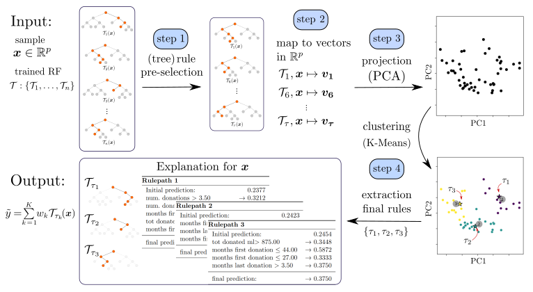

<a name="logo-anchor"></a>
<p align="center">

</p>

# Welcome to Bellatrex!

Random Forest models can be difficult to interpret, and Bellatrex addresses this challenge by generating explanations that are easy to understand, and by providing insights into how the model arrived at its predictions. Bellatrex does so by Building Explanations through a LocalLy AccuraTe Rule EXtractor (hence the name: Bellatrex) for a given test instance, by extracting only a few, diverse rules. See [the published paper](https://ieeexplore.ieee.org/abstract/document/10105927) for more details. The code for reproducing its results is available in a different [GitHub branch](https://github.com/Klest94/Bellatrex/tree/archive/reproduce-Dedja2023).

To illustrate how Bellatrex works, let's consider an example: when a user provides a test instance to Bellatrex, the tool begins by 1) pre-selecting a subset of the rules used to make the prediction; it then creates 2) a vector representation of such rules and 3) projects them to a low-dimensional space; Bellatrex then 4) clusters such representations to pick a rule from each cluster to explain the instance prediction. One rule per cluster is shown to the end user through visually appealing plots, and the tool's GUI allows users to explore similar rules to those extracted.

<table>
  <tr>
    <td align="center">
      
    </td>
  </tr>
  <tr>
    <td align="left">
      <em>Overview representation of Bellatrex, starting from top left, proceeding clockwise, we reach the output and explanation on the bottom left.</em>
    </td>
  </tr>
</table>


Another strength of Bellatrex lies in its ability to handle several prediction tasks within `scikit-learn` implementations of Random Forests. For instance, Bellatrex can generate explanations for binary classification and multi-label predictions  tasks with `RandomForestClassifier`, as well as single- or multi-output regression tasks with `RandomForestRegressor`. Moreover, Bellatrex is compatible with scikit-survival's `RandomSurvivalForest`, allowing it to generate explanations for time-to-event predictions in the presence of right-censored data.


This repository contains:
- instructions to run Bellatrex on your machine
- an overview of the datasets used to test the effectiveness of the method
- access to such datasets, as they appear after the pre-processing step.

# Set-up

To install the standard version of Bellatrex, run:

```
pip install bellatrex
```

In case the previous step does not work, then the ``pip`` distribution is not working as expected so please [contact us](https://mail.google.com/mail/u/0/?fs=1&tf=cm&source=mailto&to=daneel.olivaw94@gmail.com), and in the meantime try with a manual [clone](https://github.com/Klest94/Bellatrex) from the repository.


## Enable Graphical User Interface

For an enhanced user experience that includes interactive plots, you can etiher  pip install the following additional packages:
```
pip install dearpygui==1.6.2
pip install dearpygui-ext==0.9.5
```
Or install everything at once with:

```
pip install bellatrex[gui]
```


**Note:** When running Bellatrex with the GUI for multiple test samples, the program will generate an interactive window. The process may take a couple of seconds, and the the user has to click at least once within the generated window in order to activate the interactive mode. Once this is done, the user can explore the generated rules by clicking on the corresponding representation. To show the Bellatrex explanation for the next sample, close the interactive window and wait until Bellatrex generates the explanation for the new sample.

# Ready for the tutorial!

If you have downloaded the content of this folder and installed the packages successfully, you can dive into the [`tutorial.ipynb`](/tutorial.ipynb) code and try Bellatrex yourself.

